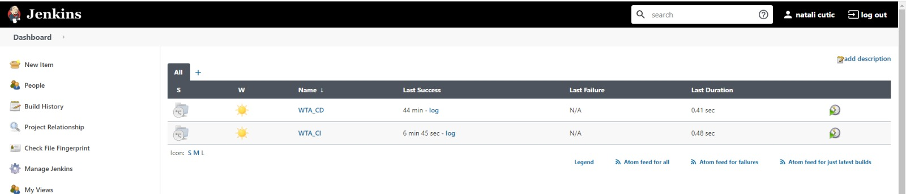
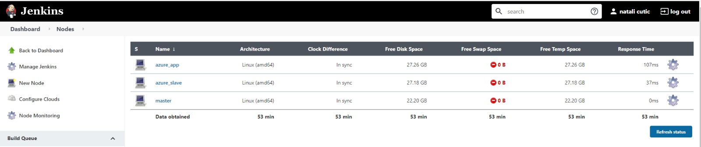
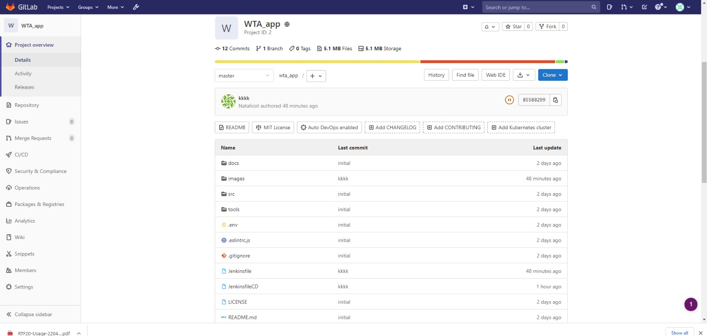
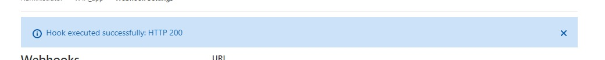
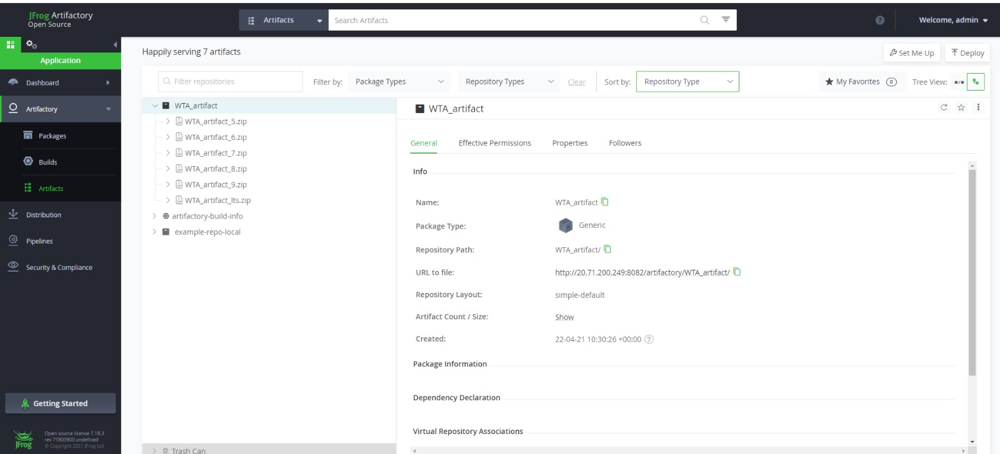

# Week 5
## CI/CD Pipeline with jenkins

Welcome To jenkins!

There are 2 pipelines:
- CI pipeline - creating an artifact and uploading to Artifactory
- CD Pipeline - Downloading the LTS artifact from artifactory and running the new app.

## Manual For using Jenkins:
(I used Jenkins inside the docker-compose added to the repo)
After starting The docker compose - dont forget to copy the initial password from the logs!

- Configure two multibranch Pipeline: WTA_CI and WTA_CD
Bouth using the same repo but not the same Jenkinsfile
- Configure two agents: Jenkins Slave and Jenkins_app_slave
One for the CI and one for the CD - https://docs.microsoft.com/en-us/azure/developer/jenkins/scale-deployments-using-vm-agents?tabs=windows
- The Plugin you neet to install:
GitLub Plugin: https://plugins.jenkins.io/gitlab-plugin/

## Manual For using GitLab:
(from the same docker-compose)
when starting git lab it will ask you to create a new password - the username is: root.

- create a new project named: WTA_App : with 2 jenkinfiles - and the app.

- For creating a web hook: ypour_project:setings:webhooks:create new with the following URL: http://<LenkinsId>:<JenkinsAPIToken>@jenkins:8080/project/WTA_CI
(The jenkins and the git Lub are in the same docker network - jenkins is a DNS name for the container)
and you can test the webHook

**If the webHook is not working try going to Admin Area:Setings:Network: out bound request and check the Allow requests to the "local network from web hooks and services" true.

## Manual For using Artifactory:
(from the same docker-compose)
when starting artifactory the initial password is: password and username: admin.

- Create a new repository for your artifacts, and insert in jenkins credential your credentials.

## If you would like to make a change to the app push the new commit to the master branch and the pipelines will do the rest :)
