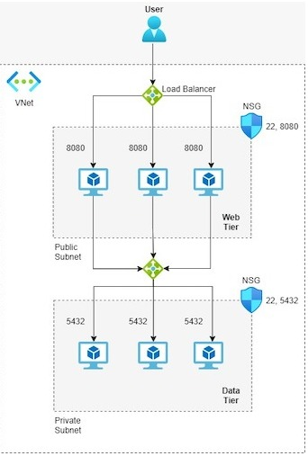

# week 4
## Terraform azure project
### The structure:



**Was added but not in the image: A BastionHost for connecting into the VM's in case of a problem.

For setting the next variables you can eather change them in the terraform.tfvars file or run terraform apply -var:

- VM Size
- VM Username
- Resource Group Name
- Location
- VNet CIDR

For entering into the server machines from the bastion use the output genereted passwords you will see in the output, for example:


## Github repo

When initialazing the VM's are running the entryPoint scripts from the folowing github repo:
https://github.com/natalicot/WTA_entryPoint

## Dyno DNS
For not paying for a constant Public IP adress but still kiping the initialization automatic I am using a free dyno DNS adress:
```sh
WTA.ddnsfree.com
```

## The app up and running


## Munual init DB
One manual thig you still have to do is the initialazation of all the dbs....
